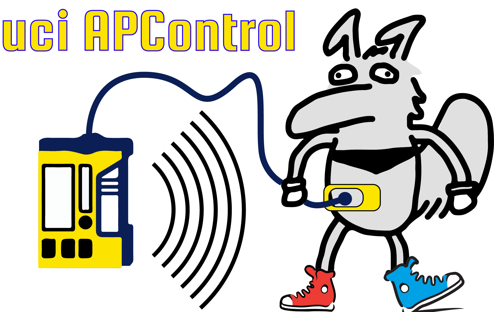

# uci AP Controller Project

uci AP Controller is an undergraduate research project started in Winter '19-20 at the University of California, Irvine. The faculty advisor for this project is [David Copp](http://engineering.uci.edu/users/david-copp). For more information, view the [project proposal](Project_Proposal.html).

Team members:
+ Michael Sutherland (https://github.com/rland93)
+ Ashutosh Shah

Documentation of the project is available on the [project wiki](https://github.com/rland93/uciAPC/wiki).
